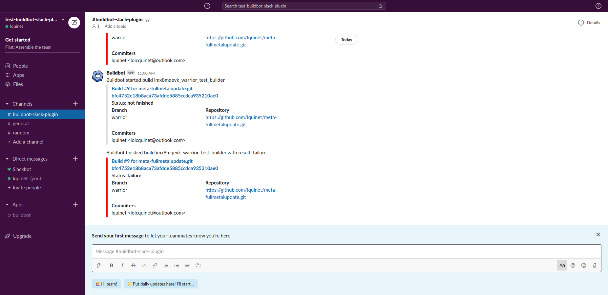

# fullmetalupdate-automation-build

This project allows to automate builds for fullmetalupdate. Each time there is a change in a branch the repository https://github.com/FullMetalUpdate/meta-fullmetalupdate-extra, a build will be triggered for all machines which depend of this branch.

This project is using buildbot, running in docker containers. For more documentation about buildbot go to https://docs.buildbot.net/current/tutorial/docker.html.

The particularity of docker in this project is that the buildbot worker container has to run a container from FMU. We are therefore using **DooD (Docker outside of Docker)** by bind-mounting host docker socket. Be aware that containers will be able to start “sibling” containers and not child containers (which can cause volume mouting, device access and network problems). More information on DooD at https://jpetazzo.github.io/2015/09/03/do-not-use-docker-in-docker-for-ci/.

This project has only been tested on Linux, but given that all is running in containers that shouldn't be an issue.

The deployment testing is performed thanks to Witekio Automation Lab, interfaced through the farm-core API which is still in developpement and internal to Witekio (for now).

## 1. Prerequisites

You must have install all dependencies of FullMetalUpdate. To see all dependancies have a look at https://www.fullmetalupdate.io/docs/documentation/.

You have also to additionnaly install docker-compose:

```sh
pip install docker-compose
```

Test if docker is running:

```sh
sudo docker run -i busybox /bin/echo Success
```

## 2. Usage

### 2.1. Start the FMU cloud server

You first have to start the FMU cloud server. This server has to be running because all builds performed with FMU need to push them to the cloud server. 

The start the cloud server please read the "Set up the server" section on the documentation of fullmetalupdate on https://www.fullmetalupdate.io/docs/documentation/.

### 2.2. Set up buildbot

In a working directory, use git to download the project

```sh
$ git clone https://github.com/lquinet/fmu-automation-build.git
$ cd fmu-automation-build
```

Before launching buildbot you have to configure some variables. All important variables are defined in the [.env](docker/master/.env) file. 

#### Build server related variables

All variables related with the build of the images

* **BUILDBOT_WORKER_WORKDIR** : working directory of the worker, which is shared with the build server machine to store all build files.
* **FMU_CLOUD_HOSTNAME** : Hostname of FMU cloud server. If you launched it on you local machine you can get it thanks to the `hostname` command.

#### Lab server config

All variables related with the automation lab infrastructure.

* **SD_CARD_DEV_PATH** : path of SD card device to flash the image builded. :warning: :warning: BE REALLY CAREFULL WITH THIS PATH, CHOOSING A WRONG DEVICE PATH COULD ENTIRELY DAMAGE YOUR HOST MACHINE (E.G. ROOT PARTITION) :warning: :warning:
* **APCPDU_IP_ADD** : IP address of APCPDU. For now only the APC type of PDU is supported.
* **APCPDU_PORT** : APCPDU port where DUT is connected.
* **APCPDU_USERNAME** : username in order to connect to the APCPDU.
* **APCPDU_PASSWORD** : password in order to connect to the APCPDU.

#### Witekio bitbucket account for farm-core repo access

Credentials to a witekio bitbucket account in order to access to farm-core repo which is a private repo (for now).

* **BITBUCKET_USERNAME** : username of the witekio bitbucket account.
* **BITBUCKET_PASSWORD** : password of the account.

#### Buildbot config

All variables related with buildbot config.

* **BUILDBOT_CONFIG_URL** : URL of buildbot master config file. It may point to a .tar.gz file accessible from HTTP, but several git servers like github can generate that tarball automatically
* **BUILDBOT_WEB_URL** : URL of buildbot web server. *Be carefull if you use localhost* because it may cause problems if you access it from the IP address of the server, in that case it is better to use its own ip address. You also have to fill the port in the URL. If you have a message *"Warning: c['buildbotURL'] is misconfigured to"* you didn't respect these indications.
* **BUILDBOT_WEB_PORT** : Port of buildbot web server.

#### Reporters config

All variables in order to provide access to the reporters. Reporters are the means to nofity developpers and team members about the status of the builds.

* **MAIL_FROM_ADDR** : Mail address from which to send mail
* **SMTP_USER** : Mail address of smtp mail account
* **SMTP_PWD** : Password of smtp mail account
* **SMTP_SERVER_HOSTNAME** : SMTP server hostname
* **SMTP_PORT** : SMTP Port
* **SMTP_ENCRYPTION** : SMTP Encryption: NONE or STARTTLS or SSL/TLS
* **GITHUB_TOKEN** : GitHub API token to push build status to the repository (go to https://github.com/settings/tokens)
* **SLACK_WEBHOOK_URL** : Slack webhook url (see https://api.slack.com/tutorials/slack-apps-hello-world)

Once you have done it, you can launch buildbot:

```sh
$ cd docker
$ docker-compose up
```
You should now be able to go to http://localhost:8010, where you will see a web page similar to:


### 2.3. Automation lab

The deployment testing is performed thanks to Witekio Automation Lab, interfaced through the farm-core API which is still in developpement and internal to Witekio (for now).

Deployment is tested by simply flash DUT SD card via SDWire and check boot string via DUT serial interface. The boot is considered successfull if the boot string "login :" is found in the boot string.

The project has been tested for raspberry pi 3 B+. The hardware has been set up as follow:
* RPI power supply plugged in to a socket of a APC PDU (APC AP7920, [documentation](http://www.apc.com/salestools/ASTE-6Z6K56/ASTE-6Z6K56_R0_EN.pdf)
* APC PDU connected to the lab network thanks to the ethernet interface.
* RPI connected to the lab network thanks to the ethernet interface.
* Serial output of RPI connected to the lab server through a serial to USB converter.
* SD card of RPI controlled by SDWire: [Documentation](https://wiki.tizen.org/SDWire). 

**For now it is only possible to test one DUT at a time**. You have manuallyt indicate the path of the SD card plugged in thanks to SDWire. You have also to enter the PDU acces in order to control the supply of the DUT (for the moment only APC type of PDU is supported).

### 2.4. GitHub integration

A reporter is configured to publishes build status using GitHub Status API. In order to use it, you have to provide a token to your GitHub account via the *GITHUB_TOKEN* variable in the [.env](docker/master/.env) file. To get a token on GitHub go to 
https://github.com/settings/tokens and click on "Generate new token". Be sure to enable enough scopes for your personnal token.

Once you have provided it, you should see build status appearing on your commits like that:


### 2.5. CI/CD badge

The CI badge of all builders are available at http://\<buildbotURL\>/badges/\<buildername\>.svg.


### 2.6. Slack integration

You can sends messages to a Slack channel when each build starts / finishes with a handy link to the build results.

This is performed thanks to the incoming webhook feature of slack apps. All you have to do is to provide a webhook url by setting the SLACK_WEBHOOK_URL variable in the [.env](docker/master/.env) file.

To get a webhook you cal follow this tutorial: https://api.slack.com/tutorials/slack-apps-hello-world.

The slack integration in buildbot has been done thanks to the non official buildbot plugin [buildbot-slack](https://github.com/rockwelln/buildbot-slack).

Here is a preview of the slack integration:



### 2.7. Mail notification

You can send email when builds finish. The way it has been configured in buildbot is to send a mail to developers who made the change in the repo which triggered the build in buildbot.

This has only been tested with office 365 addresses but more configurations are supported.

In order to make it works you have to configure several variables in the [.env](docker/master/.env) file. You have to provide a mail address from which all mails are sent (MAIL_FROM_ADDR). You also have to indicate the parameters related with the stmp server:
* Connection security : SMTP_ENCRYPTION (NONE or STARTTLS or SSL/TLS)
* Stmp port : SMTP_PORT (default is 25)
* Server hostname : SMTP_SERVER_HOSTNAME (default is localhost)
* User name for authentification on the server : SMTP_USER (don't set the variable if your SMTP host doesn't require authentication)
* Password for authentification on the server : SMTP_PWD (don't set the variable if your SMTP host doesn't require authentication)

Typical config for office 365 mail is SMTP_ENCRYPTION=STARTTLS ; SMTP_PORT=587 and requires SMTP_USER and SMTP_PWD which are login and password of the mail account related to MAIL_FROM_ADDR.

## 3. Customisation

### 3.1. master.cfg

If you want to customise the behavior of buildbot, you have to modify the [master.cfg](master.cfg) file.

In this file you can modify workers behavior, changes sources, schedulers, builders, and so on.

There are some custom variables:

* **REPOS_TO_TRACK**: Dict of URL of the repositories to track for changes. 
    * `"build_branch"` means that a change in a branch of the repo will trigger the build for the supported machines for this branch. Be carefull it has to be a Yocto branch supported by FMU.
    * `"build_all"` means that a change in the branch **"master"** of this repo will trigger the build of all machine/branch combinations.
* **BRANCH_MACHINE_PAIRS**: Defines the branches of *REPO_URL* to track and the dependant machines.
* **YOCTO_REPO_URL**: URL of the local server repository of FMU.

```python
# Custom variables
REPOS_TO_TRACK = {
    "https://github.com/lquinet/meta-fullmetalupdate-extra.git" : "build_branch",
    "https://github.com/lquinet/meta-fullmetalupdate.git" : "build_branch",
    "https://github.com/lquinet/fullmetalupdate.git" : "build_all",
    "https://github.com/lquinet/fullmetalupdate-yocto-demo.git" : "build_all",
}
SUPPORTED_MACHINES_ROCKO=["imx6qdlsabresd", "raspberrypi3"]
SUPPORTED_MACHINES_THUD=["imx8mqevk", "stm32mp1-disco"]
SUPPORTED_MACHINES_WARRIOR=["imx8mqevk"]
BRANCH_MACHINE_PAIRS = {
    "rocko" : SUPPORTED_MACHINES_ROCKO,
    "thud" : SUPPORTED_MACHINES_THUD,
    "warrior" : SUPPORTED_MACHINES_WARRIOR,
}
YOCTO_REPO_URL="https://github.com/lquinet/fullmetalupdate-yocto-demo.git"
```

### 3.2. docker-compose.yml and .env

The [docker-compose.yml](docker/master/docker-compose.yml) file depends on the [.env](docker/master/.env) file.

You can directly change the parameters of buildbot containers by modifying [docker-compose.yml](docker/master/docker-compose.yml).


## 4. Suggested improvements

* Support multiple DUT connected to the lab server (several SDwire?)
* Improve boot string analysis
* Detect automatically the path of sd card device to flash the new image. For that you can:
```python
from farmcore import Hub
Hub(...).get_block()
Hub(...).get_part()
```
replace ... with the USB path of course (can probably just use 'usb1' if you don't know the USB path of the hub)
`get_block()` will find you block devices
`get_part()` will find you partitions

Both will return a data structure with the device file path in it. You can get it to give you only the device file path by doing: `Hub(...).get_block('devnode')`

All of the Hub's get_xxx methods search the downstream USB tree for devices of a certain type, and return a data structure containing lots of info about them.
By default you only get the first matching one found, but you can pass another argument all=True to get a list of everything found that matches if needed